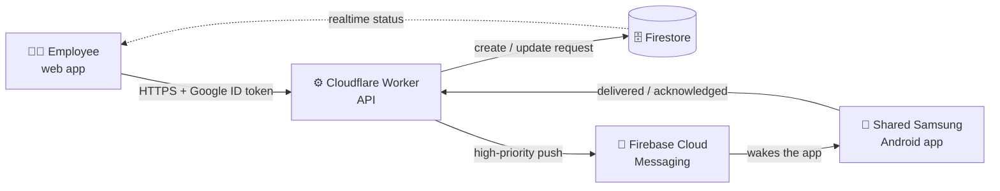
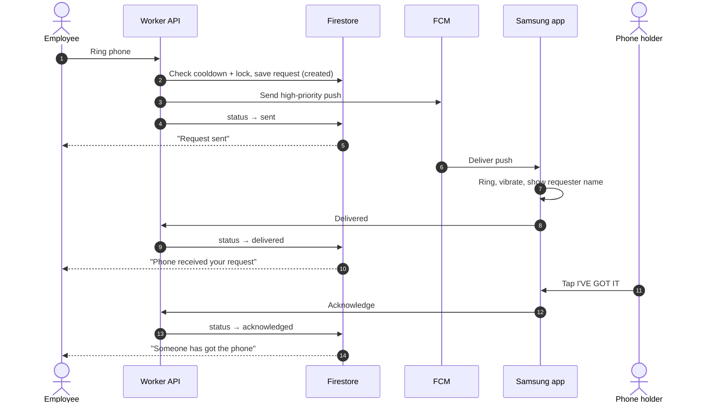
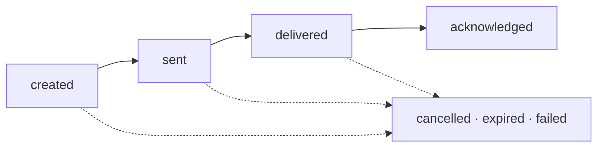

<div align="center">

# 🔔 Arnifi Phone Bell

**Find Arnifi's shared UAE calling phone in seconds. Press one button, the phone rings wherever it is, and you see the moment someone picks it up.**

[](https://github.com/UX-ankit1514/Phone-Ring/actions/workflows/ci.yml)


</div>

---

## Contents

- [The problem](#the-problem)
- [How it works for people](#how-it-works-for-people)
- [What it solves](#what-it-solves)
- [How it works under the hood](#how-it-works-under-the-hood)
- [Tech stack](#tech-stack)
- [Repository layout](#repository-layout)
- [Getting started](#getting-started)
- [Configuration](#configuration)
- [Commands](#commands)
- [Deploying](#deploying)
- [Setting up the shared phone](#setting-up-the-shared-phone)
- [API reference](#api-reference)
- [Security](#security)
- [Staying free](#staying-free)
- [Testing](#testing)
- [FAQ and troubleshooting](#faq-and-troubleshooting)
- [Further documentation](#further-documentation)

---

## The problem

Arnifi has **one Samsung phone** for UAE calls, shared by **about 50 employees**. The phone moves from desk to desk all day, so anyone who needs it has to walk around the office asking who has it.

Making the call isn't the hard part. Finding the phone is.

## How it works for people

Phone Bell swaps the office-wide search for one button:

| Step | Who | What happens |
| :-: | --- | --- |
| 1 | You | Open the Phone Bell website and sign in with your `@arnifi.com` Google account. |
| 2 | You | Enter your name once. This is the name the phone shows. |
| 3 | You | Press **RING PHONE**. |
| 4 | The phone | Rings and vibrates for 10 seconds and shows *"Rahul Sharma is asking to use this phone"*, even if it's locked with the screen off. |
| 5 | Whoever has it | Taps **I'VE GOT IT**. |
| 6 | You | Your screen changes to *"Someone has got the phone"* straight away, with no page refresh. |

> [!NOTE]
> Only the shared Samsung needs an app. Everyone else just uses the website.

### Who uses what

| You are... | You use | You can |
| --- | --- | --- |
| **An employee who needs the phone** | The website | Sign in, ring the phone, follow the status live, cancel a request |
| **The person holding the phone** | The Android app on the Samsung | Hear who's asking and tap **I'VE GOT IT** |
| **An administrator** | The Android app and the setup scripts | Enroll the phone once, keep it ready, rotate secrets |
| **A developer** | This repository | Build, test and deploy every part |

---

## What it solves

### ✅ For employees

- **One tap instead of a search.** You don't need to ask around the office.
- **You always know where your request is.** The website shows *Sent* → *Phone received* → *Acknowledged*. *Sent* only means Firebase accepted the message. The site shows *Phone received* only after the phone itself confirms it.
- **You can cancel.** If you find the phone another way, cancel the request and the phone stops ringing.
- **No confusion when two people need the phone at once.** Only one request can be active. Anyone else sees *"The UAE phone is already being requested. Please wait."*
- **An offline phone doesn't leave you stuck.** If the phone hasn't confirmed after 15 seconds, the site warns you it may be offline. Requests expire safely after 60 seconds, and then you can ring again.
- **Reloading doesn't lose anything.** Your name and any request in progress are still there after a refresh.

### 📱 For the person holding the phone

- **It rings wherever the phone is:** locked, screen off, or with the app in the background.
- **It shows who's asking**, so you know who to take the phone to.
- **One tap stops the ring and replies.** If the phone is offline at that moment, the reply is queued and sent when it reconnects.
- **Test Ring and Diagnostics** check notifications, volume, Do Not Disturb, internet and push registration, so you can fix setup problems before they matter.

### 🛡️ Reliable by design

- **One click means one ring.** Double-clicks, network retries and duplicate push messages never make the phone ring twice.
- **Each person has a 20-second cooldown** between requests to stop spam.
- **Old requests never ring late.** If a push arrives after its request has expired, the phone ignores it.
- **It fixes itself.** A background job runs every minute to expire stuck requests and free the phone.

### 🔐 Secure by default

- **Only verified `@arnifi.com` Google accounts can ring the phone**, and the server checks this on every request.
- **The phone joins with a one-time enrollment code.** No secrets are built into the app.
- **Browsers can't send push messages** or see the phone's push token.
- **The server's Google account has only the three narrow permissions it needs.**

### 💸 Costs nothing to run

- Everything runs on **Firebase's free Spark plan** and **Cloudflare Workers Free**, with **no billing account**. If a free limit is ever reached, requests fail. The project never gets a bill.

### 🤖 Works with AI assistants in the browser

- In browsers that support the [WebMCP proposal](https://github.com/webmachinelearning/webmcp), the page offers two tools, `get_uae_phone_status` and `create_uae_phone_request`. A browser AI assistant can then check the phone and ring it for you, using your signed-in session.

---

## How it works under the hood



> [!IMPORTANT]
> **Design rule:** The push message (FCM) is what makes the phone ring. Firestore holds the official state of every request. The phone never polls the database to decide when to ring.

### One request from start to finish



### Request statuses



| Status | What the website says | What it means |
| --- | --- | --- |
| `created` | *Preparing the alert…* | The API saved your request. |
| `sent` | *Request sent. Waiting for the phone…* | Firebase accepted the push. This doesn't prove the phone received it. |
| `delivered` | *Phone received your request* | The Samsung confirmed receipt and is ringing. |
| `acknowledged` | *Someone has got the phone* | The holder tapped **I'VE GOT IT**. |
| `cancelled` | *Request cancelled* | You cancelled, and the phone was told to stop. |
| `expired` | *No one acknowledged* | Nobody answered within 60 seconds. You can ring again. |
| `failed` | *Unable to send the request* | The push couldn't be sent. |

A status only moves forward. For a deeper explanation of locks, recovery and expiry, see [ARCHITECTURE.md](ARCHITECTURE.md).

---

## Tech stack

| Part | Built with | Runs on |
| --- | --- | --- |
| Employee website | React 19, TypeScript, Vite | Firebase Hosting |
| API, push sender and expiry job | TypeScript Cloudflare Worker (REST + Cron Trigger) | Cloudflare Workers Free |
| Request state and live updates | Cloud Firestore | Firebase Spark |
| Sign-in and device identity | Firebase Authentication (Google) | Firebase Spark |
| Push to the phone | Firebase Cloud Messaging HTTP v1 | Free |
| Phone app | Kotlin, Jetpack Compose, foreground service, WorkManager, DataStore | Shared Samsung (Android 8+) |

---

## Repository layout

```text
.
├── web/                 Employee website (React + TypeScript)
├── worker/              The deployed API: REST routes, state machine, FCM sender, 1-minute cron
├── android/             Phone app for the shared Samsung (Kotlin + Jetpack Compose)
├── packages/contracts/  Request and response types shared by the website and the API
├── firebase/            Firestore security rules and indexes
├── functions/           The same backend as Firebase Functions: not deployed (needs the paid
│                        Blaze plan), kept as a ready alternative; also runs the rules tests
├── scripts/             Google Cloud provisioning and API-URL setup helpers
├── docs/                Step-by-step runbooks (setup, deploy, testing, troubleshooting)
├── ARCHITECTURE.md      How the system works in depth
└── SECURITY.md          Security model and pre-production checklist
```

---

## Getting started

### Prerequisites

| Tool | Needed for |
| --- | --- |
| Node.js 22 and npm | Everything (run `nvm use`) |
| JDK 21 | Firestore rules tests (Firebase emulator) |
| JDK 17 and Android SDK 36 | Building the phone app |
| Free Cloudflare account | Deploying the API |
| Firebase projects on the Spark plan | Sign-in, database, hosting, push |

### 1. Install and check everything builds

```bash
git clone https://github.com/UX-ankit1514/Phone-Ring.git
cd Phone-Ring
nvm use
npm install
npm run build
npm test
```

### 2. Try the website without any setup (demo mode)

Demo mode runs the full interface with a sample user and no Firebase connection. It's the quickest way to see the product.

```bash
VITE_DEMO_MODE=true npm run dev:web
```

Open <http://127.0.0.1:5173>.

### 3. Run against the real dev backend

```bash
cp web/.env.example web/.env.local            # fill in the dev Firebase web-app values
cp worker/.dev.vars.example worker/.dev.vars  # fill in the two Worker secrets

npm run dev:worker   # terminal 1: API on http://127.0.0.1:8787
npm run dev:web      # terminal 2: website on http://127.0.0.1:5173 (proxies /api to the Worker)
```

> [!WARNING]
> `npm run dev:worker` connects to the **real dev Firebase project**, so local testing writes real dev data.

---

## Configuration

| Where | What goes there | Committed? |
| --- | --- | --- |
| `web/.env.local` | Firebase web-app values, API URL, allowed email domain ([template](web/.env.example)) | ❌ No |
| `worker/wrangler.toml` | Non-secret API settings per environment: `APP_ENVIRONMENT`, `FIREBASE_PROJECT_ID`, `ALLOWED_WORKSPACE_DOMAIN`, `TARGET_DEVICE_ID` | ✅ Yes |
| Wrangler secrets | `GOOGLE_SERVICE_ACCOUNT_JSON` and `DEVICE_ENROLLMENT_CODE` | ❌ Never |
| `android/firebase.properties` | Android Firebase values, API URL, release-signing paths ([template](android/firebase.properties.example)) | ❌ No |
| Firestore `config/sharedPhone` | Operating settings, adjustable without a redeploy (see below) | n/a |

### Operating settings (`config/sharedPhone`)

| Setting | Default | Allowed range | Controls |
| --- | :-: | :-: | --- |
| `ringDurationSeconds` | 10 | 3–30 | How long the phone rings |
| `requestTimeoutSeconds` | 60 | 30–300 | When an unanswered request expires |
| `targetterCooldownSeconds` | 20 | 5–300 | Wait between requests from the same person |
| `deliveryTimeoutSeconds` | 15 | 5–60 | When the website warns the phone may be offline |
| `vibrationEnabled` | `true` | | Vibrate while ringing |

If the document is missing, the API uses the defaults. Values outside the allowed range are clamped to fit.

---

## Commands

Run these from the repository root.

| Command | What it does |
| --- | --- |
| `npm run dev:web` | Start the website at `127.0.0.1:5173` |
| `npm run dev:worker` | Start the API at `127.0.0.1:8787` |
| `npm run build` | Build contracts, backends and the website |
| `npm run build:dev` / `build:prod` | Build with dev or production website settings |
| `npm test` | Run the Functions, Worker and website test suites |
| `npm run test:rules` | Test Firestore security rules in the emulator (JDK 21) |
| `npm run typecheck` | Type-check every TypeScript workspace |
| `npm run emulators` | Start the local Firebase emulators |
| `npm run deploy:dev` / `deploy:prod` | Deploy the Worker, then Firestore rules and Hosting |

Phone app (from `android/`):

```bash
./gradlew testDevDebugUnitTest assembleDevDebug                       # dev build
./gradlew testProdDebugUnitTest lintProdRelease assembleProdRelease   # production build
```

---

## Deploying

The project has two separate environments: **dev** (`arnifi-phone-bell-dev`) and **prod** (`arnifi-phone-bell-prod`). Always get dev fully working first.

```bash
# One-time: create the least-privilege Google service account and install the Worker secrets
node scripts/cloudflare/provision-google.mjs apply --project dev
node scripts/cloudflare/provision-google.mjs install-secrets --project dev --worker-dir worker

# First deploy
npm run deploy:worker:dev                          # prints the workers.dev URL
node scripts/set-worker-url.mjs dev <worker-url>   # points the website and phone app at it
npm run deploy:firebase:dev                        # website, rules, indexes

# Check it's alive
curl -s <worker-url>/api/v1/health
# → {"success":true,"service":"arnifi-phone-bell","environment":"dev"}

# Later releases
npm run deploy:dev
```

To deploy production, repeat the steps with `prod`. Full guides:

- [Zero-cost Cloudflare infrastructure](docs/cloudflare-zero-cost.md): service account, secrets, key rotation
- [The API on Cloudflare Workers](docs/cloudflare-worker.md): configuration, logs, rollback
- [Firebase dev and production setup](docs/firebase-setup.md): projects, sign-in, config, data retention
- [Release APK](docs/release-apk.md): versioning, signing and rollout of the phone app

---

## Setting up the shared phone

1. Build the APK and install it on the Samsung.
2. Open **Arnifi Phone Bell** and enter the **one-time enrollment code** from an administrator.
3. Open **Diagnostics** and check that it reports: Firebase configured, enrollment complete, FCM token registered, notifications ready, audio ready.
4. Tap **TEST RING** and make sure you can hear it.
5. Rotate the enrollment code right away.

Keep the phone ready to ring:

- Keep notifications on for the **UAE Phone Requests** channel, and keep notification volume up.
- Set battery use to **Unrestricted**. Don't put the app in *Sleeping* or *Deep sleeping apps*.
- Allow background data, and keep Google Play services up to date.
- Don't force-stop the app.

> [!CAUTION]
> The app **respects Silent mode and Do Not Disturb** on purpose. If the phone is silenced, a request arrives but makes no sound. Keep the phone audible during working hours.

The full guide is in [Android installation and enrollment](docs/android-installation.md).

---

## API reference

All routes are under `/api/v1`. Each response has `success: true` or `success: false` with an `error` object that includes `code`, `message` and `retryable`.

<details>
<summary><b>Show all routes</b></summary>

| Method | Route | Who can call it | Purpose |
| --- | --- | --- | --- |
| `GET` | `/health` | Anyone | Liveness check |
| `GET` | `/devices/{deviceId}/status` | Signed-in employee | Whether the phone is idle or busy, plus its health |
| `POST` | `/phone-requests` | Signed-in employee | Ring the phone (repeating a `clientRequestId` returns the same request) |
| `POST` | `/phone-requests/{id}/cancel` | The employee who made it | Cancel an active request |
| `POST` | `/devices/enroll` | The phone, with its one-time code | Enroll the phone and get its identity |
| `POST` | `/devices/register` | The enrolled phone | Save or refresh its push token |
| `POST` | `/devices/heartbeat` | The enrolled phone | Report that it's online |
| `POST` | `/phone-requests/{id}/delivered` | The enrolled phone | Confirm it received the request |
| `POST` | `/phone-requests/{id}/acknowledge` | The enrolled phone | Report that someone tapped **I'VE GOT IT** |

Employees authenticate with a Firebase ID token from a verified `@arnifi.com` account. The phone authenticates with a Firebase ID token that carries `role=target` and its device ID. Shared request and response types are in [`packages/contracts`](packages/contracts/src/index.ts).

</details>

---

## Security

| Area | Protection |
| --- | --- |
| **Who can ring** | Only verified `@arnifi.com` Google accounts. The server checks the token on every call; hiding buttons in the UI is never the only check. |
| **Phone identity** | A one-time enrollment code is exchanged for a device identity, and the code can't be reused. The APK contains no secrets. |
| **Push tokens** | Stored in a server-only collection. Browsers can't read them or send pushes. |
| **Database** | Firestore rules block every client write to request state, locks, cooldowns and configuration. Employees can read only their own requests. |
| **Cloud permissions** | A dedicated service account has three narrow custom roles: Firestore documents, device identity and FCM send. It has no Owner, Editor or Admin roles. |
| **Logs** | Auth headers, enrollment codes, push tokens and secrets are never logged. |

Never commit service-account files, enrollment codes, keystores or signing passwords. `.gitignore` already excludes them. The full model and pre-production checklist are in [SECURITY.md](SECURITY.md).

---

## Staying free

There's no billing account on either Firebase project or the Cloudflare account.

| Service | Free limit that matters | What happens at the limit |
| --- | --- | --- |
| Cloudflare Workers Free | 100,000 requests/day, 10 ms CPU per request | Requests fail (Error 1027). No bill. |
| Firebase Spark | Published Auth, Firestore and Hosting quotas | Work is rejected or delayed. No automatic upgrade. |
| Firebase Cloud Messaging | No charge | n/a |

Features that normally need the paid Blaze plan are rebuilt on free services:

| Normally | Here |
| --- | --- |
| Cloud Functions | Cloudflare Worker |
| Cloud Tasks expiry queue | Cron Trigger that runs every minute |
| Firestore TTL policies | The same cron deletes documents past their `deleteAt` date: idempotency keys after 1 day, events after 30, requests after 90 |

---

## Testing

```bash
npm test             # Functions, Worker and website unit tests
npm run test:rules   # Firestore security rules (emulator, JDK 21)
cd android && ./gradlew testDevDebugUnitTest lintDevDebug
```

| Suite | Covers |
| --- | --- |
| Worker | State machine, validation, idempotent retries, one push per request, expiry, push failure, recovery, enrollment, ID-token verification |
| Firestore rules | `@arnifi.com` identity checks, profile validation, owner-only request reads, denial of every private write |
| Website | Local storage and name handling |
| Android | Push message parsing and settings storage |

GitHub Actions ([`ci.yml`](.github/workflows/ci.yml)) runs the build, all TypeScript tests, the rules tests, a Worker bundle dry run and both Android variants on every push and pull request.

> [!NOTE]
> Real push delivery can't be emulated. Before going live, work through the physical Samsung test matrix in [docs/testing.md](docs/testing.md): locked, screen off, Doze, battery saver, offline, and so on.

---

## FAQ and troubleshooting

<details>
<summary><b>My request says "Sent" but never "Phone received".</b></summary>

Firebase accepted the push, but the phone hasn't confirmed it. The phone is probably offline, force-stopped or restricted by battery settings. The request expires on its own after 60 seconds, and then you can ring again. Administrators should check Diagnostics on the phone.
</details>

<details>
<summary><b>It says "Phone received" but nobody heard it.</b></summary>

The phone is probably on Silent or Do Not Disturb, or its notification volume is at zero. The app respects these settings on purpose. Diagnostics shows **Audio: suppressed** when this is happening.
</details>

<details>
<summary><b>Test Ring works, but real requests don't arrive.</b></summary>

Check, in order:

1. The APK environment (dev/prod) matches the website.
2. Diagnostics shows enrolled and token registered.
3. Worker logs (`wrangler tail --env dev`) show `REQUEST_CREATED` and `FCM_SEND_SUCCEEDED`.
4. The phone has internet and Google Play services and isn't force-stopped or sleeping.
</details>

<details>
<summary><b>What happens if two people ring at the same time?</b></summary>

The first request wins. The second person is told the phone is already being requested, and their button is disabled until the first request ends.
</details>

<details>
<summary><b>Can I ring again right away?</b></summary>

Each person has to wait 20 seconds between requests. This stops accidental spam.
</details>

<details>
<summary><b>I cancelled, but the phone kept ringing.</b></summary>

The cancel push may have been delayed. The phone always stops on its own when the ring duration ends. Check the request timeline for `CANCEL_FCM_SENT` or `CANCEL_FCM_FAILED`.
</details>

<details>
<summary><b>Does this cost anything?</b></summary>

No. See [Staying free](#staying-free).
</details>

More fixes are in [docs/troubleshooting.md](docs/troubleshooting.md).

---

## Further documentation

| Document | Read it when you want to... |
| --- | --- |
| [ARCHITECTURE.md](ARCHITECTURE.md) | Understand the request path, collections, state model and concurrency |
| [SECURITY.md](SECURITY.md) | Review the security model before production |
| [docs/firebase-setup.md](docs/firebase-setup.md) | Create and configure the Firebase projects |
| [docs/cloudflare-zero-cost.md](docs/cloudflare-zero-cost.md) | Provision the service account and Worker secrets |
| [docs/cloudflare-worker.md](docs/cloudflare-worker.md) | Configure, deploy, monitor or roll back the API |
| [docs/android-installation.md](docs/android-installation.md) | Build the phone app, enroll it and set up the Samsung |
| [docs/release-apk.md](docs/release-apk.md) | Sign and roll out a production APK |
| [docs/testing.md](docs/testing.md) | Run automated tests and the physical acceptance matrix |
| [docs/troubleshooting.md](docs/troubleshooting.md) | Fix delivery, sound or registration problems |
| [docs/deployment-status.md](docs/deployment-status.md) | See what's provisioned and what remains before go-live |
| [arnifi_shared_uae_phone_bell_advanced_prd.pdf](arnifi_shared_uae_phone_bell_advanced_prd.pdf) | Read the original product requirements |

---

<div align="center">
<sub>Internal tool built for Arnifi · Private repository</sub>
</div>
